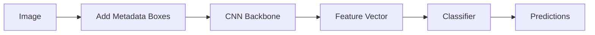
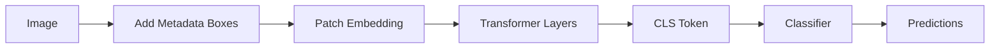
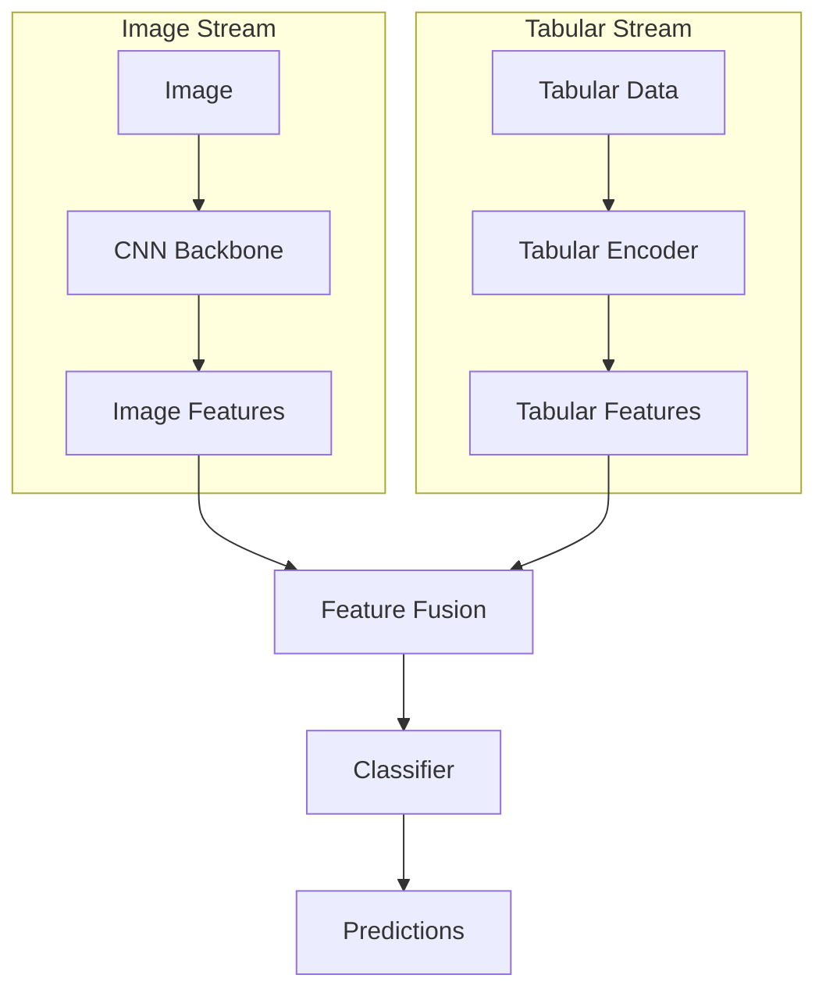
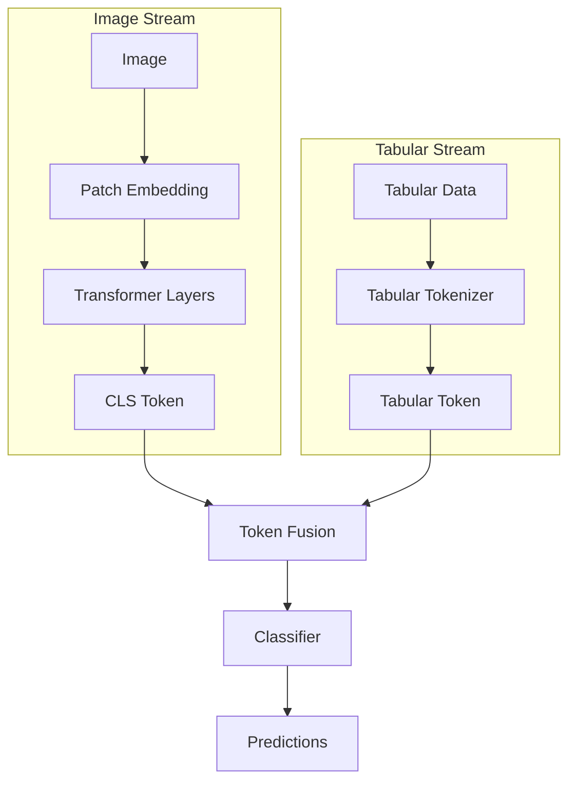

# ChestX-ray14 Multi-Modal Deep Learning

This project explores the integration of tabular patient data with deep learning models for chest X-ray classification using the ChestX-ray14 dataset. We compare CNN and Vision Transformer architectures with two different methods of tabular data integration.

## Project Structure

```
cs-7643-final-project/
├── downloaded_data/          # Example location for Kaggle download (not in repo)
│   ├── images-224/          # Resized images
│   ├── Data_Entry_2017.csv  # Metadata and labels
│   ├── train_val_list_NIH.txt # Training/Validation image list
│   └── test_list_NIH.txt    # Test image list
├── notebooks/               # Jupyter notebooks for analysis
├── src/                    # Source code
│   ├── config.py           # Configuration management
│   ├── data/               # Data handling
│   │   ├── dataset.py      # PyTorch datasets
│   │   ├── preprocessing.py # Data transforms
│   │   └── integration.py  # Tabular data integration
│   └── models/             # Model implementations
│       ├── cnn_baseline.py  # Baseline CNN
│       ├── vit_baseline.py  # Baseline ViT
│       ├── cnn_embed.py     # CNN with embedded metadata
│       ├── cnn_fusion.py    # CNN with feature fusion
│       ├── vit_embed.py     # ViT with embedded metadata
│       └── vit_fusion.py    # ViT with token fusion
├── results/                # Experimental results
├── environment.yaml        # Conda environment
└── README.md              # This file
```

## Model Architectures

### Method 1: Image Embedding

#### CNN with Embedded Metadata



#### ViT with Embedded Metadata



### Method 2: Feature/Token Fusion

#### CNN with Feature Fusion



#### ViT with Token Fusion



## Setup

1.  **Install KaggleHub:** If you haven't already:
    ```bash
    pip install kagglehub
    ```
2.  **Create Environment:** Set up the conda environment:
    ```bash
    conda env create -f environment.yaml
    conda activate cs7643-project
    ```
3.  **Download Data:** Use KaggleHub to download the dataset. This might require Kaggle API credentials configured.
    ```python
    import kagglehub
    # Download latest version (will be placed in ~/.cache/kagglehub/datasets/...)
    path = kagglehub.dataset_download("khanfashee/nih-chest-x-ray-14-224x224-resized")
    print("Path to dataset files:", path)
    # You might want to move/symlink this path to a more convenient location
    ```
4.  **Configure Paths:** Update `src/config.py` (or use a separate config file/command-line args) to point `data_dir` to the directory containing `images-224`, `metadata_path` to `Data_Entry_2017.csv`, and add paths for `train_val_list_path` and `test_list_path`.

## Models

### Baseline Models

- **CNN**: ResNet50 backbone pretrained on ImageNet
- **ViT**: Vision Transformer (base patch16) pretrained on ImageNet

### Integration Methods

#### Method 1: Image Embedding

- Encodes tabular data as visual elements (boxes) in the input image
- Age encoded as grayscale intensity
- Gender and View Position encoded as binary (black/white) boxes
- Boxes can be positioned at top, bottom, or right of image

#### Method 2: Feature/Token Fusion

- **CNN**: Fuses CNN features with encoded tabular features before classification
- **ViT**: Prepends a special tabular token alongside the CLS token

### Tabular Features

- Patient Age (normalized)
- Patient Gender (Male/Female)
- View Position (PA/AP)

## Training

The models can be trained independently using different configurations in `src/config.py`. Each model variant has its own training and validation steps with appropriate data handling for its integration method.

## Results

Results will be saved in the `results` directory, including:

- Model checkpoints
- Training logs
- Evaluation metrics
- Visualization plots

## Notes

- Feature fusion methods use learnable weights to balance the importance of image and tabular features
- Vision Transformer implementations support attention visualization (TODO)
- Data splitting uses the official `train_val_list_NIH.txt` and `test_list_NIH.txt` files to prevent data leakage based on Patient ID.
