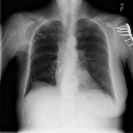
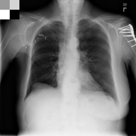

# CS7643 Deep Learning Final Project
## Vision Models with Clinical Data Integration for Chest X-ray Analysis

### Project Overview
This project investigates the impact of integrating clinical tabular data with vision models (Vision Transformers and CNNs) for chest X-ray analysis. We explore and compare two distinct approaches for combining clinical metadata with image data:

1. **Multimodal Approach**: Modifying the classifier head to accept clinical tabular data alongside image features
2. **Embedded Approach**: Converting clinical tabular data into a 2x2 matrix and embedding it directly into the image

The project utilizes the NIH Chest X-ray dataset, augmented with clinical metadata including patient age, gender, view position, and follow-up information.

### Methodology

#### Model Architectures
We implement and compare several vision models:
- DenseNet (121 and 201 variants)
- Vision Transformer (ViT) configurations:
  - ViT-B/16
  - ViT-B/32
  - ViT-L/16

Each model is tested with both integration approaches:
1. **Multimodal Integration**:
   - Base vision model processes the image
   - Clinical features are concatenated with image features
   - Modified classifier head processes combined features
   
2. **Embedded Integration**:
   - Clinical data is transformed into a 2x2 matrix
   - Matrix is embedded into the original X-ray image
   - Standard vision model processes the augmented image

#### Dataset
The dataset structure includes:
- Chest X-ray images
- Clinical features:
  - Patient Age
  - Patient Gender
  - View Position
  - Follow-up Number
- Multiple disease labels for multi-label classification

### Implementation

#### Project Structure
```
.
├── src/
│   ├── data/           # Data loading and preprocessing
│   ├── models/         # Model architectures
│   └── utils/          # Training, inference, and utility functions
├── experiments/        # Experiment scripts
├── environment.yaml    # Conda environment specification
└── run_*.py           # Execution scripts for different tasks
```

#### Key Components
- `src/data/dataset.py`: Custom dataset implementation for NIH Chest X-ray data
- `src/utils/trainer.py`: Model training logic with support for both integration approaches
- `experiment*.py`: Various experimental configurations and comparisons

### Setup and Usage

1. Environment Setup
```bash
conda env create -f environment.yaml
conda activate [environment-name]
```

2. Data Preparation
```bash
python run_prepare_data.py
```

3. Training
```bash
python run_trainer.py
```

4. Inference
```bash
python run_inference.py
```

5. Running Experiments
```bash
python experiment[N].py  # Replace N with experiment number
```

### Configuration and Parameters

The project uses configuration files and command-line arguments for flexible experimentation:

- Model parameters (dropout, hidden dimensions)
- Training parameters (learning rate, batch size)
- Data processing settings (matrix size for embedded approach)
- Experiment-specific configurations

### Results

The project evaluates models based on:
- Classification performance (AUC-ROC)
- Training time and convergence
- Model efficiency and inference speed

Key findings and comparisons are documented in experimental results and analysis files.

### Project Files

Key experiment files:
- `experiment1.py`: Base model comparisons
- `experiment2.py`: Convergence analysis and timing comparisons
- Additional experiments for in-depth analysis and ablation studies

Utility scripts:
- `run_trainer.py`: Main training execution
- `run_inference.py`: Model inference
- `run_prepare_data.py`: Data preprocessing
- `run_calculate_dataset_stats.py`: Dataset statistics

### Development Tools

- Training supports both CPU and GPU environments
- Includes comprehensive logging and visualization tools
- Implements early stopping and learning rate scheduling
- Supports focal loss for handling class imbalance

### Requirements

The project requires:
- Python 3.12+
- PyTorch
- torchvision
- pandas
- numpy
- scikit-learn
- kagglehub
- matplotlib
- tqdm
- See `environment.yaml` for a complete list of dependencies

## Example Embedded Image



## Example Results
Despite only having access to quite weak clinical correlations to the pathologies we were predicting, there was a statistically significant increase in the AUC and F1 scores of the MM model over the standard model on average and in several specicific pathologies. The following summarizes the results of our experiments:

```text
====== SUMMARY OF STATISTICAL ANALYSIS ======
Number of standard files: 12
Number of MM files: 12

------ Overall AUC Scores ------
Weighted Auc:
  MM model mean: 0.7295 ± 0.0097
  Standard model mean: 0.7275 ± 0.0092
  Difference: 0.0020 (+0.28%)
  P-value: 0.0001 (Significant)
  Sample size: 12

Macro Auc:
  MM model mean: 0.7419 ± 0.0149
  Standard model mean: 0.7403 ± 0.0146
  Difference: 0.0016 (+0.22%)
  P-value: 0.0752 (Not significant)
  Sample size: 12

Micro Auc:
  MM model mean: 0.8811 ± 0.0046
  Standard model mean: 0.8803 ± 0.0043
  Difference: 0.0007 (+0.08%)
  P-value: 0.0024 (Significant)
  Sample size: 12

------ Overall F1 Scores ------
Micro Avg F1:
  MM model mean: 0.4312 ± 0.0116
  Standard model mean: 0.4300 ± 0.0180
  Difference: 0.0013 (+0.29%)
  P-value: 0.7458 (Not significant)
  Sample size: 12

Macro Avg F1:
  MM model mean: 0.2339 ± 0.0136
  Standard model mean: 0.2322 ± 0.0127
  Difference: 0.0017 (+0.73%)
  P-value: 0.0750 (Not significant)
  Sample size: 12

Weighted Avg F1:
  MM model mean: 0.4770 ± 0.0090
  Standard model mean: 0.4751 ± 0.0086
  Difference: 0.0019 (+0.41%)
  P-value: 0.0007 (Significant)
  Sample size: 12

------ Individual Class AUC Scores ------
Atelectasis Auc:
  MM model mean: 0.7303 ± 0.0112
  Standard model mean: 0.7277 ± 0.0094
  Difference: 0.0026 (+0.36%)
  P-value: 0.0288 (Significant)
  Sample size: 12

Cardiomegaly Auc:
  MM model mean: 0.7461 ± 0.0472
  Standard model mean: 0.7473 ± 0.0462
  Difference: -0.0012 (-0.16%)
  P-value: 0.6672 (Not significant)
  Sample size: 12

Consolidation Auc:
  MM model mean: 0.7585 ± 0.0076
  Standard model mean: 0.7592 ± 0.0070
  Difference: -0.0008 (-0.10%)
  P-value: 0.2925 (Not significant)
  Sample size: 12

Edema Auc:
  MM model mean: 0.8467 ± 0.0103
  Standard model mean: 0.8445 ± 0.0100
  Difference: 0.0022 (+0.26%)
  P-value: 0.0497 (Significant)
  Sample size: 12

Effusion Auc:
  MM model mean: 0.8121 ± 0.0158
  Standard model mean: 0.8096 ± 0.0157
  Difference: 0.0025 (+0.31%)
  P-value: 0.0014 (Significant)
  Sample size: 12

Emphysema Auc:
  MM model mean: 0.7897 ± 0.0143
  Standard model mean: 0.7851 ± 0.0157
  Difference: 0.0047 (+0.60%)
  P-value: 0.0695 (Not significant)
  Sample size: 12

Fibrosis Auc:
  MM model mean: 0.7158 ± 0.0185
  Standard model mean: 0.7160 ± 0.0146
  Difference: -0.0002 (-0.03%)
  P-value: 0.9391 (Not significant)
  Sample size: 12

Hernia Auc:
  MM model mean: 0.8029 ± 0.0489
  Standard model mean: 0.8029 ± 0.0543
  Difference: 0.0000 (+0.01%)
  P-value: 0.9965 (Not significant)
  Sample size: 12

Infiltration Auc:
  MM model mean: 0.6731 ± 0.0060
  Standard model mean: 0.6714 ± 0.0062
  Difference: 0.0016 (+0.24%)
  P-value: 0.0498 (Significant)
  Sample size: 12

Mass Auc:
  MM model mean: 0.6958 ± 0.0198
  Standard model mean: 0.6969 ± 0.0178
  Difference: -0.0011 (-0.16%)
  P-value: 0.4645 (Not significant)
  Sample size: 12

No Finding Auc:
  MM model mean: 0.7280 ± 0.0067
  Standard model mean: 0.7259 ± 0.0064
  Difference: 0.0021 (+0.29%)
  P-value: 0.0000 (Significant)
  Sample size: 12

Nodule Auc:
  MM model mean: 0.6512 ± 0.0181
  Standard model mean: 0.6503 ± 0.0134
  Difference: 0.0009 (+0.13%)
  P-value: 0.7186 (Not significant)
  Sample size: 12

Pleural Thickening Auc:
  MM model mean: 0.7213 ± 0.0159
  Standard model mean: 0.7227 ± 0.0145
  Difference: -0.0014 (-0.20%)
  P-value: 0.5239 (Not significant)
  Sample size: 12

Pneumonia Auc:
  MM model mean: 0.6680 ± 0.0181
  Standard model mean: 0.6642 ± 0.0149
  Difference: 0.0038 (+0.57%)
  P-value: 0.2419 (Not significant)
  Sample size: 12

Pneumothorax Auc:
  MM model mean: 0.7895 ± 0.0207
  Standard model mean: 0.7808 ± 0.0214
  Difference: 0.0088 (+1.12%)
  P-value: 0.0011 (Significant)
  Sample size: 12

------ Individual Class F1 Scores ------
Atelectasis F1:
  MM model mean: 0.3077 ± 0.0110
  Standard model mean: 0.3051 ± 0.0077
  Difference: 0.0026 (+0.84%)
  P-value: 0.1551 (Not significant)
  Sample size: 12

Cardiomegaly F1:
  MM model mean: 0.1569 ± 0.0435
  Standard model mean: 0.1535 ± 0.0422
  Difference: 0.0034 (+2.21%)
  P-value: 0.3962 (Not significant)
  Sample size: 12

Consolidation F1:
  MM model mean: 0.1905 ± 0.0089
  Standard model mean: 0.1890 ± 0.0073
  Difference: 0.0014 (+0.77%)
  P-value: 0.2421 (Not significant)
  Sample size: 12

Edema F1:
  MM model mean: 0.1807 ± 0.0149
  Standard model mean: 0.1816 ± 0.0124
  Difference: -0.0009 (-0.50%)
  P-value: 0.7041 (Not significant)
  Sample size: 12

Effusion F1:
  MM model mean: 0.4196 ± 0.0255
  Standard model mean: 0.4165 ± 0.0248
  Difference: 0.0031 (+0.74%)
  P-value: 0.0429 (Significant)
  Sample size: 12

Emphysema F1:
  MM model mean: 0.1991 ± 0.0244
  Standard model mean: 0.1943 ± 0.0217
  Difference: 0.0048 (+2.47%)
  P-value: 0.2581 (Not significant)
  Sample size: 12

Fibrosis F1:
  MM model mean: 0.0782 ± 0.0092
  Standard model mean: 0.0778 ± 0.0112
  Difference: 0.0004 (+0.52%)
  P-value: 0.9051 (Not significant)
  Sample size: 12

Hernia F1:
  MM model mean: 0.0359 ± 0.0284
  Standard model mean: 0.0373 ± 0.0328
  Difference: -0.0014 (-3.66%)
  P-value: 0.8222 (Not significant)
  Sample size: 12

Infiltration F1:
  MM model mean: 0.3782 ± 0.0053
  Standard model mean: 0.3753 ± 0.0058
  Difference: 0.0029 (+0.78%)
  P-value: 0.0037 (Significant)
  Sample size: 12

Mass F1:
  MM model mean: 0.1935 ± 0.0187
  Standard model mean: 0.1935 ± 0.0176
  Difference: 0.0000 (+0.00%)
  P-value: 0.9962 (Not significant)
  Sample size: 12

No Finding F1:
  MM model mean: 0.7300 ± 0.0038
  Standard model mean: 0.7288 ± 0.0043
  Difference: 0.0012 (+0.16%)
  P-value: 0.0072 (Significant)
  Sample size: 12

Nodule F1:
  MM model mean: 0.1755 ± 0.0171
  Standard model mean: 0.1772 ± 0.0140
  Difference: -0.0017 (-0.98%)
  P-value: 0.5139 (Not significant)
  Sample size: 12

Pleural Thickening F1:
  MM model mean: 0.1394 ± 0.0103
  Standard model mean: 0.1406 ± 0.0095
  Difference: -0.0013 (-0.91%)
  P-value: 0.6272 (Not significant)
  Sample size: 12

Pneumonia F1:
  MM model mean: 0.0579 ± 0.0081
  Standard model mean: 0.0596 ± 0.0072
  Difference: -0.0018 (-2.94%)
  P-value: 0.3617 (Not significant)
  Sample size: 12

Pneumothorax F1:
  MM model mean: 0.2648 ± 0.0226
  Standard model mean: 0.2522 ± 0.0230
  Difference: 0.0126 (+5.00%)
  P-value: 0.0003 (Significant)
  Sample size: 12
```

## Warning

This project was made for a class and under a time constraint. The code is not optimized and is not meant for production use. It is a proof of concept and should be treated as such. The code may contain bugs and is not guaranteed to work in all environments. Use at your own risk.